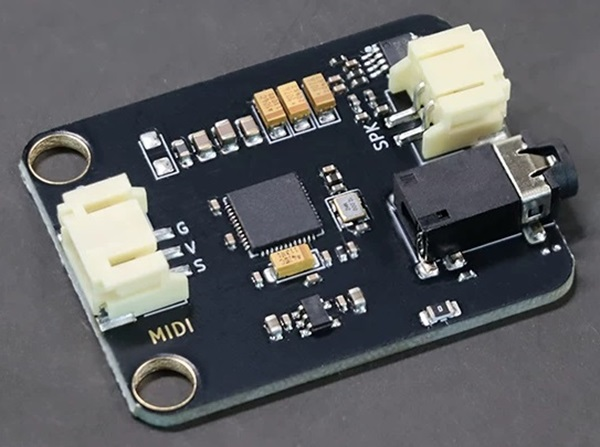
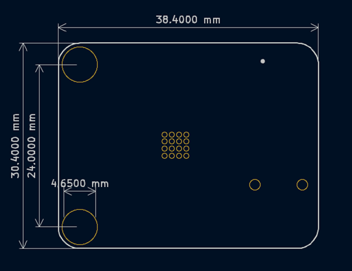

# MIDI-Module
## Product Image

## Intrduction
MIDI Digital Music Module is a professional music synthesis module based on the General MIDI 2.0 standard, featuring complete MIDI audio processing and output capabilities. The module is equipped with a rich wavetable sound library, including 128 General MIDI tones and 128 extended tones, as well as dozens of professional percussion sounds.
The module supports 16 independent MIDI channels, with Channel 9 dedicated to professional percussion sounds, enabling complex multi-channel music arrangement. In terms of audio processing, the module supports up to 64-voice polyphony simultaneously (without effects) or 38-voice polyphony with effects, featuring 32-note polyphonic processing capability to ensure smooth multi-part performance.
The module integrates a professional-grade audio effects system, featuring a built-in 4-band parametric equalizer, multiple reverb and chorus effects, and a stereo audio amplifier that allows direct playback through headphones or speakers. By inputting standard MIDI signals via the serial interface, it outputs high-fidelity stereo audio.
This module is compatible with mainstream controllers such as Arduino, micro:bit, and ESP32, making it suitable for applications including electronic instrument design, educational programming kits, and various embedded audio systems. It provides a complete audio solution for embedded music applications.
**Note:** When using headphones for playback, some types of headphones are not compatible with this module and may cause playback issues. It is recommended to use 4-pole (TRRS) headphones.

## Module Parameters
| Parameter               | Specification                                                            |
| ----------------------- | ------------------------------------------------------------------------ |
| Baud Rate               | 31.25 × (1 ± 0.01) Kbaud                                                 |
| Operating Voltage       | 5V/3.3V                                                                  |
| Interface               | PH2.0 pitch connector                                                    |
| Connection Method       | PH2.0 3-pin anti-reverse connection cable                                |
| Dimensions              | 38.4 × 30.4 mm (compatible with LEGO bricks and M4 screw mounting holes) |
| Headphone Jack Diameter | 3.5 mm                                                                   |
| Support Board           | Arduino、ESP32                                                           |

## Pin
| Pin | Specification |
| --- | ------------- |
| G   | GND           |
| V   | 5V/3.3V       |
| S   | Signal        |

## Mechanical Drawing

## Functional Overview
### Channel Characteristics
The module adopts a multi-channel synthesizer architecture with 16 independent MIDI channels (0–15, with Channel 9 dedicated to percussion/rhythm). Each channel can be independently configured with instrument timbre, volume, pan, and various effects parameters, enabling complex multi-part music arrangement.

### Channel Assignment Features:
Channels 0–8, 10–15: Melodic instrument channels
Channel 9: Dedicated percussion channel supporting multiple drum kit sound sets
All channels support real-time timbre switching and parameter control

### Audio Synthesis Characteristics
#### Sound Library System
The module features two complete sound banks, plus a dedicated percussion sound bank for Channel 9:

- Standard GM Sound Bank (Bank 0): 128 General MIDI instrument tones
- Expanded Sound Bank (Bank 127): 128 enhanced and special tones
- Dedicated Percussion Bank: Multiple professional drum kits, accessible via Channel 9

#### Effects Processing System
  Built-in DSP effects processing engine delivering broadcast-quality audio:

#### Equalizer System
- 4-band parametric equalizer: Independent adjustment for Low / Low-Mid / High-Mid / High frequencies
- Each band supports ±12 dB gain adjustment
- Supports channel-independent EQ settings

#### Spatial Effects
- Reverb Effects: Multiple reverb types including Room Reverb, Hall Reverb, Plate Reverb, Church Reverb, and more
- Chorus Effects: Multiple chorus types including Stereo Chorus, Ensemble Chorus, Flanger Chorus, and more
- Pan Control: Precise stereo positioning adjustment

## Datasheet
[Click here download ATSAM2695 datasheet](https://docs.dream.fr/pdf/Serie2000/SAM_Datasheets/SAM2695.pdf)
[PDF of the schematic](./midi_module.pdf)

## Arduino Applications
[Click here view Arduino Library API Documentation](https://emakefun-arduino-library.github.io/em_midi/html/en/classem_1_1_midi.html) 
[Click here download Arduino example program](ttps://github.com/emakefun-arduino-library/em_midi/archive/refs/tags/v1.0.0.zip) 

### Arduino Library Examples
- Channel 9 Percussion Playback – Demonstrates drum kit playback via the dedicated percussion channel
- GM Sound Bank Melody Playback – Plays a melody using the Steel String Guitar from the standard GM sound bank

## Micropython Example Program
- ESP32 MicroPython Example: [Click here to download the ESP32 MicroPython example program](https://github.com/emakefun-micropython-lib/em_mpy_midi/archive/refs/tags/v1.0.0.zip)

## micro:bit MakeCode Example Programs
Microbit MakeCode extension link: https://github.com/emakefun-makecode-extensions/emakefun_midi
- [Click to view the "Twinkle Twinkle Little Star" example](https://makecode.microbit.org/_CUmDPi0bXdPF)
- [Click to view the "Happy Birthday" example](https://makecode.microbit.org/_a98A056hve3b)
- [Click to view the "Drum Kit" example](https://makecode.microbit.org/_5hV3Wt7CL4Ye)
